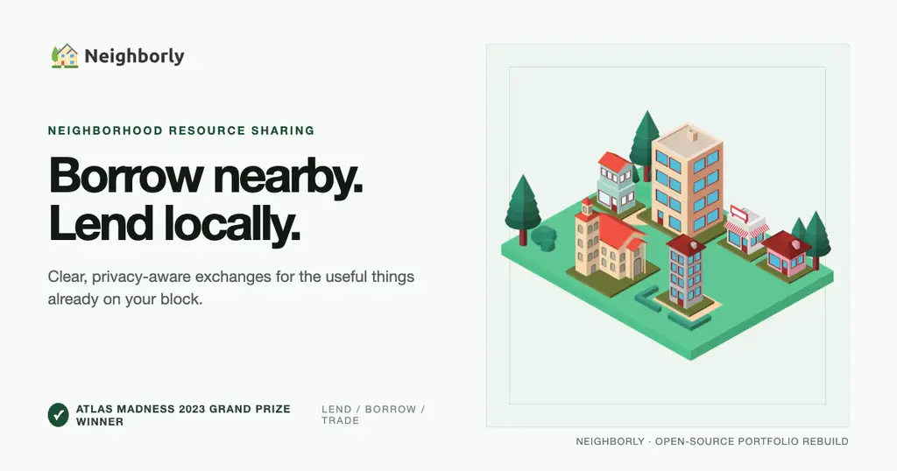
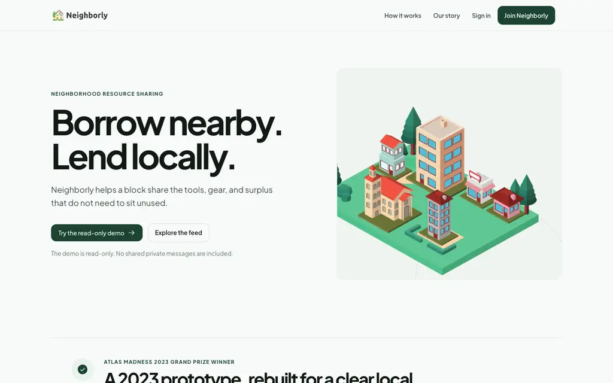
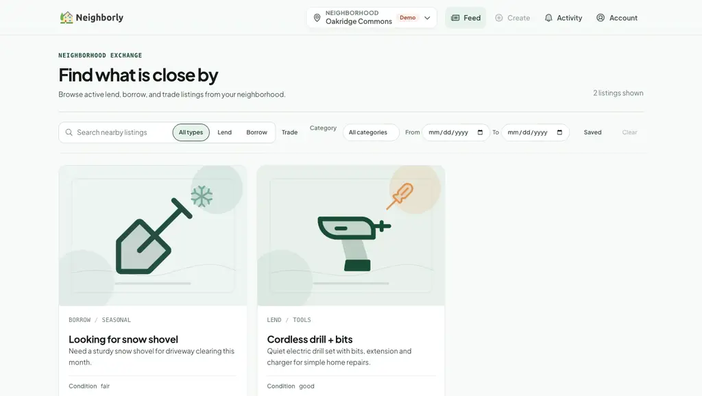
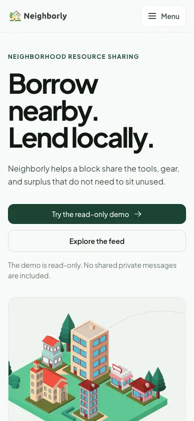
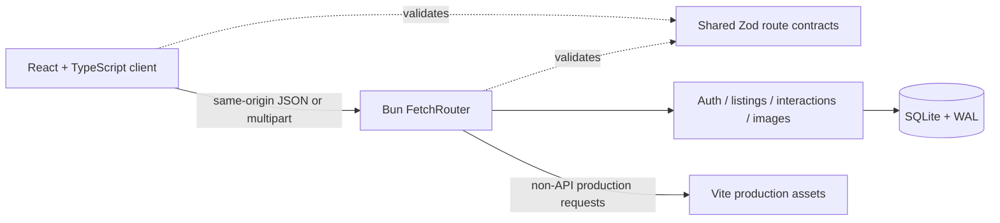

# Neighborly



Neighborly is a neighborhood resource-sharing application for lending, borrowing, and trading useful items nearby. It began as the **Atlas Madness 2023 Grand Prize** hackathon project and was rebuilt in 2026 as a complete full-stack portfolio product: typed APIs, durable local data, private exchange workflows, accessible responsive UI, and a production container that serves the React app and API from one process.

The product keeps a deliberately smaller promise than a general social network. A member chooses a neighborhood, finds something useful, makes a clear request, coordinates privately with the other participant, and records the completed handoff.

- Original submission: [Devpost](https://devpost.com/software/neighborly-42ghs1)
- Stack: React, TypeScript, Bun, SQLite, Zod, Sharp, Vite, CSS Modules

## Product preview

<table>
  <tr>
    <td></td>
    <td></td>
  </tr>
  <tr>
    <td align="center">Public product story</td>
    <td align="center">Authenticated neighborhood feed</td>
  </tr>
</table>

<p align="center">
  
</p>

## Product tour

### Neighborhood discovery

- Neighborhood-scoped feed with text, listing-type, category, date, and saved filters
- URL-backed filter state, cursor pagination, retryable failures, and explicit empty/offline states
- Public landing-page preview limited to three curated listings; private member data never enters that payload

### Listings

- Lend, borrow, and trade forms with type-specific validation
- Create, edit, withdraw, and image management flows
- Up to three JPEG, PNG, or WebP uploads per listing
- Server-side MIME inspection, pixel and byte limits, metadata stripping, and WebP normalization
- Saves, reactions, public comments, and owner moderation

### Exchanges and trust

- Type-specific request details and availability dates
- Owner accept/decline controls and participant cancellation
- Participant-only message threads
- Accepted-to-completed lifecycle with stale-transition protection
- One review per participant after completion
- Neighbor profiles with active listings, completed exchange history, response rate, and aggregate reputation

### Account and access

- Registration, sign-in, sign-out, session recovery, password change, and profile settings
- Neighborhood onboarding and guarded neighborhood switching
- Read-only public demo with mutation controls disabled in both the UI and API
- Responsive navigation, keyboard focus management, skip links, announcements, reduced-motion support, and route-level loading/error boundaries

## Try it locally

### Requirements

- [Bun](https://bun.sh/) 1.3.x
- Optional: Docker for the production image

### Development

```bash
bun install
bun run dev
```

Open <http://localhost:5173>. Vite serves the client and proxies `/api` to Bun on port `3001`.

The first development start creates `data/neighborly.sqlite`, runs every migration, and loads deterministic portfolio fixtures.

#### Read-only walkthrough

Choose **Try the read-only demo** on the home or sign-in page. This account can browse the feed and public product surfaces, but cannot create listings, change settings, interact, request, review, or access private fixture conversations.

#### Full workflow fixtures

Use two same-neighborhood members to exercise a complete request and handoff:

| Member | Email | Password |
| --- | --- | --- |
| Listing owner | `alma@neighborly.local` | `AlmaHousework1!` |
| Requesting neighbor | `ben@neighborly.local` | `BenGardens4$` |

These credentials exist only in development seeding. Production seeding randomizes every fixture password and exposes only the credentialless read-only demo route.

### Useful commands

```bash
bun run format:check   # formatting verification
bun run check          # TypeScript + Biome checks
bun run lint           # Biome lint only
bun test               # backend, contract, and static-serving behavior
bun run build          # optimized Vite client
```

## Architecture



The shared contract registry in `src/lib/contracts.ts` defines each route's method, path, params, query, body, success envelope, and canonical errors. The browser client and Bun router both consume that registry, preventing a second hand-written wire format.

### Repository map

```text
src/
  components/       product UI and accessible primitives
  contexts/         authenticated session and navigation state
  hooks/            abort-aware API resource state
  lib/              shared route contracts and typed client
  pages/            lazy-loaded public and authenticated routes
  styles/           design tokens and global reset
server/
  routes/            thin HTTP route registration
  auth.ts            sessions, passwords, CSRF, and rate limits
  listings.ts        feed and listing policy
  interactions.ts    requests, messages, comments, reviews, reputation
  images.ts          upload validation and normalization
  db.ts/schema.ts    SQLite configuration and migrations
  seed.ts            deterministic development/public-demo fixtures
  static.ts          secure production SPA/static handler
assets/listings/     local seeded listing artwork
```

## Security and privacy boundaries

Neighborly is designed for a local exchange, not identity verification, payments, shipping, ads, or precise-address discovery.

- Session identifiers are stored in `HttpOnly`, `SameSite=Lax` cookies; production cookies are `Secure`.
- Every authenticated mutation also requires a session-bound CSRF token.
- Unsafe requests must match the request URL's origin or `NEIGHBORLY_PUBLIC_ORIGINS`.
- Registration, login, demo login, and contact submissions have bounded in-memory rate limits.
- Zod schemas validate external request and response boundaries; each schema explicitly defines whether to reject unknown fields.
- Private request details and messages are returned only to the listing owner and requester.
- Completed-review text and ratings are visible to authenticated members of the reviewed member's neighborhood.
- The demo principal is enforced as read-only on the server; disabled controls are only the visible layer.
- Listing images are stored in SQLite and served only to their current authorized audience, except explicitly curated public-preview listings.

See [`ROADMAP.md`](./ROADMAP.md) for the implementation contract, transition matrix, privacy rules, and release gates used during the rebuild.

## Database operations

SQLite runs with foreign keys, a busy timeout, WAL journaling, and `synchronous=NORMAL`. Production requires an explicit persistent path.

```bash
export NEIGHBORLY_DB_PATH=/absolute/path/to/neighborly.sqlite

bun run db:check
bun run db:backup /absolute/path/to/backups/neighborly.sqlite

# Stop the application before restoring.
bun run db:restore /absolute/path/to/backups/neighborly.sqlite
```

Backups use `VACUUM INTO` for a consistent snapshot of committed WAL state. Restore validates both the source and staged copy, checkpoints the offline target, rejects path aliases, and atomically publishes the replacement only after integrity checks pass.

## Production deployment

### One-process Bun deployment

```bash
bun install --frozen-lockfile
bun run build

NODE_ENV=production \
NEIGHBORLY_DB_PATH=/var/lib/neighborly/neighborly.sqlite \
NEIGHBORLY_PUBLIC_ORIGINS=https://neighborly.example \
NEIGHBORLY_TRUST_PROXY=1 \
PORT=3001 \
bun run start
```

Production runs behind a trusted HTTPS reverse proxy. `NEIGHBORLY_PUBLIC_ORIGINS` is a non-empty comma-separated list of canonical absolute HTTP(S) origins, such as `https://neighborly.example` without credentials, a trailing slash, path, query, or fragment. It lets the server recognize an HTTPS `Origin` when the proxy rewrites the request URL; it does not enable CORS or cross-origin browser access. `NEIGHBORLY_TRUST_PROXY` must be `1` in production.

### Docker

```bash
docker build -t neighborly .
docker volume create neighborly-data
docker network create neighborly-private

docker run --rm \
  --name neighborly \
  --network neighborly-private \
  -v neighborly-data:/data \
  -e NEIGHBORLY_PUBLIC_ORIGINS=https://neighborly.example \
  -e NEIGHBORLY_TRUST_PROXY=1 \
  neighborly
```

Attach the HTTPS reverse proxy to `neighborly-private`; do not publish Bun's port with `-p`. The proxy overwrites the request `Host` and forwarded protocol, then appends its peer address to `X-Forwarded-For`:

```nginx
location / {
  proxy_pass http://neighborly:3001;
  proxy_set_header Host $host;
  proxy_set_header X-Forwarded-Proto $scheme;
  proxy_set_header X-Forwarded-For $proxy_add_x_forwarded_for;
}
```

The runtime image:

- runs as the non-root `bun` user;
- serves `dist/` and `/api` from one Bun process;
- persists the SQLite database, WAL, and SHM files under `/data`;
- uses `GET /api/health` for bounded migration/read and writeability readiness checks; run `bun run db:check` offline for the full integrity scan;
- contains production dependencies and only the fixture images required at runtime.

Production cookies require HTTPS. For an HTTP-only local container walkthrough, explicitly override `NODE_ENV=development`; never expose that fixture mode publicly.

## Configuration

| Variable | Default | Purpose |
| --- | --- | --- |
| `NODE_ENV` | development behavior | Enables production fail-closed paths and secure cookies when set to `production` |
| `PORT` | `3001` | Bun HTTP port |
| `NEIGHBORLY_DB_PATH` | `./data/neighborly.sqlite` outside production | Persistent SQLite path in production; required there, and `:memory:` is rejected |
| `NEIGHBORLY_PUBLIC_ORIGINS` | Vite loopback origins in development | Required non-empty comma-separated canonical absolute HTTP(S) origins in production; recognizes proxy-rewritten same-site requests and does not enable CORS |
| `NEIGHBORLY_TRUST_PROXY` | disabled | Must be `1` in production; accepts only the rightmost IP-valid `X-Forwarded-For` value from the trusted reverse proxy |

## Project lineage

The 2023 prototype used MongoDB Atlas App Services, Realm authentication, GraphQL, Firebase uploads, Create React App, and Bulma. The rebuild intentionally removes that retired service surface rather than hiding it behind compatibility code. The current application owns its contracts, storage, authorization, deployment, failure states, and demo story end to end while preserving the original goal: help nearby people share more and waste less.
