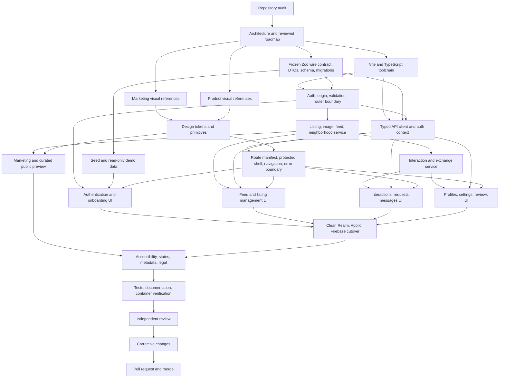

# Neighborly improvement roadmap

## Product read

Neighborly is a neighborhood resource-sharing product, not a general social network. Its portfolio-worthy version should make one complete promise: a neighbor can discover a useful item nearby, request it safely, coordinate the handoff, return or complete the exchange, and leave a trust signal for the next neighbor.

Nextdoor is useful inspiration for neighborhood identity, local context, and trust. Neighborly keeps its sharper differentiator: borrowing, lending, and trading underused resources instead of adding news, ads, events, public-agency alerts, or a generic social feed.

## Audit baseline

The current repository proves the concept but cannot reproduce the shipped application:

- The React client points at MongoDB Realm app `neighborly-app-zadig`, while the exported `client/realm_config.json` names a different app. Required schemas, rules, functions, and the `postsWithAuthors` resolver are absent.
- MongoDB Atlas App Services authentication and direct SDK function access reached end of life in September 2025. The current `realm-web` authentication path is no longer a viable foundation.
- Firebase Storage rules, the Google Places setup, and the contact Cloud Function are not versioned. A fresh clone depends on the original author's cloud accounts.
- The core resource flow ends at a free-text post. There is no request, approval, handoff, status, message, completion, or review lifecycle.
- Authentication failures are silent. Registration redirects even after failure. Forgot password is a no-op. Contact discards the message field.
- The image gallery opens automatically and disables obvious closing controls. Feed errors replace the whole app, empty states are missing, and profiles display fabricated statistics.
- The CRA 5, Gulp, Bulma, Node 16, and nginx build is obsolete. The only test imports the wrong file and asserts the removed CRA starter copy.
- The current interface has no coherent responsive, accessibility, loading, error, metadata, or legal system.

## Scope

### Required product journeys

1. **Visitor proof**
   - Understand the resource-sharing premise without creating an account.
   - See realistic listing previews and the Atlas Madness award context.
   - Enter a working read-only demo with one click, without sharing mutable data or private threads across visitors.

2. **Identity and neighborhood**
   - Register, sign in, sign out, and restore a secure session.
   - Choose from seeded neighborhoods without sending precise addresses to a third party.
   - Update profile and neighborhood settings.
   - Change a password while authenticated. Forgotten-password email delivery is intentionally not offered without a versioned mail provider.

3. **Discovery**
   - Browse a paginated neighborhood feed.
   - Search and filter by lend, borrow, trade, category, availability, and saved status.
   - See useful empty, loading, offline, and error states.

4. **Resource management**
   - Create, edit, withdraw, and conditionally delete a structured listing under explicit retention rules.
   - Add bounded, decoded, metadata-stripped local image uploads.
   - View a dedicated listing page with owner, condition, availability, comments, reactions, and saves.

5. **Exchange lifecycle**
   - Request a lend with required dates, answer a borrow request with a structured offered item, or propose a structured item in a trade.
   - Let the listing owner accept or decline a pending request.
   - Keep one accepted request per listing and resolve competing requests atomically.
   - Let either participant coordinate in a private request thread.
   - Complete or cancel the exchange with actor-specific, transactional transitions.

6. **Trust**
   - Show completed exchanges, response history, member tenure, and real review aggregates.
   - Allow one review per participant after a completed exchange.
   - Never claim address verification the app does not perform.

7. **Portfolio quality**
   - Run from a fresh clone with one documented command and seeded data.
   - Ship a production container, behavior tests, accessible flows, social metadata, privacy and terms pages, and a credible technical README.

### Explicit non-goals

- General neighborhood news, events, groups, business ads, safety alerts, or public-agency publishing.
- Precise-address verification, payments, shipping, identity-document checks, or real-time WebSockets.
- A microservice split, cache tier, queue, cloud object-storage adapter, or generic repository abstraction.
- Compatibility shims for Realm, Apollo, Firebase, Gulp, Bulma, or CRA.
- Password-recovery email delivery. The broken forgot-password affordance is removed; authenticated password change remains supported.

## Architecture decisions

| Area | Decision | Reason |
| --- | --- | --- |
| Runtime | Bun 1.3+ | One runtime supplies HTTP, password hashing, SQLite, scripts, and tests. |
| Client | React + TypeScript + Vite | Retains the product's React foundation while replacing deprecated CRA and Gulp. |
| Server | Same-origin REST API with `Bun.serve` | Small, explicit contracts are easier to secure and demonstrate than reconstructing missing GraphQL infrastructure. |
| Storage | SQLite in WAL mode on one local POSIX volume and one application replica | Self-contained and deterministic while preserving SQLite locking and durability guarantees. |
| Authentication | 32-byte CSPRNG session token in a hardened cookie; only its SHA-256 hash is stored | Avoids browser token storage, supports revocation, and supplies at least 256 bits of entropy. |
| Passwords | `Bun.password` Argon2id with 8 to 128 byte input bounds before hashing | Current memory-hard password hashing without unbounded CPU work. |
| Images | Sharp-decoded, dimension-bounded WebP blobs stored with metadata in SQLite | Removes Firebase, strips EXIF and GPS data, and keeps uploads reproducible. |
| Validation | Shared Zod request, response, and runtime schemas | Freezes one executable browser/server wire contract before parallel implementation. |
| Styling | CSS custom properties + CSS Modules | Preserves local ownership, supports a real token system, and avoids a second framework. |
| Icons and type | Phosphor icons + self-hosted Plus Jakarta Sans variable font | Versioned, accessible assets with a friendly civic tone and no render-blocking kit. |
| State | Route data + local React state + auth context | Product size does not justify a global state library. |
| Testing | `bun test` for API contracts + browser smoke for real journeys | Defends authorization and state transitions, then verifies the shipped behavior. |

### Server boundaries

```text
Browser
  |
  | same-origin JSON, multipart, HttpOnly cookie
  v
Bun HTTP application
  |-- authentication and session boundary
  |-- validation and canonical error mapping
  |-- listing and neighborhood queries
  |-- interaction and exchange state transitions
  |-- image delivery
  v
SQLite database + seeded demo data
```

### Security invariants

- The server derives the acting user from the session. Clients never submit authoritative owner, author, sender, reviewer, reviewee, or neighborhood-membership identifiers.
- Every SQL statement uses bound parameters. Foreign keys, check constraints, pair uniqueness, and the accepted-request partial unique index defend invariants below the handler layer.
- Every non-safe request requires a present `Origin` that exactly matches the request URL's origin or a configured `NEIGHBORLY_PUBLIC_ORIGINS` value, including register, login, demo login, logout, contact, and authenticated mutations. Development adds only the two Vite loopback origins. Production requires non-empty canonical absolute HTTP(S) origins plus `NEIGHBORLY_TRUST_PROXY=1`; those origins recognize proxy-rewritten same-site requests and do not enable CORS or cross-origin browser access.
- Register, login, demo login, and contact do not require an existing session. Every other non-safe route does.
- Session tokens contain 32 CSPRNG bytes, are stored only as SHA-256 hashes, expire, rotate after authentication, and are revoked on logout. The cookie is `HttpOnly`, `SameSite=Lax`, `Path=/`, `Secure` in production, and is cleared with identical attributes.
- Login, registration, demo login, and contact have bounded in-memory rate limits under the supported single-replica topology.
- JSON bodies are capped at 64 KiB before parsing. Passwords, search values, profile fields, listing copy, comments, messages, reviews, and contact fields have shared schema limits.
- Multipart bodies are capped at 16 MiB before full buffering. A listing accepts at most three images, 5 MiB each, and 20 megapixels each. Magic bytes and decode success must match JPEG, PNG, or WebP; accepted files are re-encoded to WebP without submitted metadata. A rejected request creates no rows.
- Public preview returns curated seed DTOs. Member listing and profile reads are same-neighborhood. Requests and messages are participant-only. Email is self-only. Password hashes, session hashes, contact records, and private fields are server-only.
- The public demo principal is read-only. Every demo mutation except logout returns `DEMO_READ_ONLY`, and request or message endpoints expose no private fixture data.
- Listing ownership gates edit, withdraw, and delete. Request and review actors follow the transition matrix below. Stale or forbidden transitions return a canonical 409 or 403 without partial writes.
- API errors have one shape: `{ "error": { "code": string, "message": string, "fields"?: object } }`. Internal exceptions and sensitive values never reach clients or logs.

## Data model

- `neighborhoods`: id, slug, name, city, state, IANA timezone, description, bundled image path.
- `users`: id, email, password hash, name, handle, avatar path, bio, neighborhood id, demo flag, created at, last active.
- `sessions`: token hash, user id, expires at, created at. Expired rows are purged without affecting exchange history.
- `listings`: id, owner id, neighborhood id, type enum (`lend`, `borrow`, `trade`), title, description, category, condition, date-only `available_from`, date-only `available_through`, availability notes, wanted item, status enum (`active`, `reserved`, `completed`, `withdrawn`), deleted at, created at, updated at. Dates use the neighborhood's IANA timezone and satisfy `available_through >= available_from`.
- `listing_images`: id, listing id, canonical MIME type, width, height, alt text, WebP data, sort order.
- `listing_saves`: listing id, user id, created at, unique per pair.
- `listing_reactions`: listing id, user id, created at, unique per pair.
- `comments`: id, listing id, author id, body, created at, updated at.
- `requests`: id, listing id, requester id, requested start/end dates, structured offered-item title/description/condition, opening message, status enum (`pending`, `accepted`, `declined`, `cancelled`, `completed`), cancelled by user id, cancellation reason, created at, updated at. Listing owner and neighborhood are derived through the immutable listing relation, not submitted or duplicated.
- `messages`: id, request id, sender id, body, created at, read at.
- `reviews`: id, request id, reviewer id, reviewee id derived as the opposite participant, rating 1 to 5, body, created at, unique per request and reviewer.
- `contact_messages`: id, name, email, message, created at, purge after. Server-only, inaccessible to client routes, retained for 30 days, and excluded from application logs.

### State transitions

| Command | Actor and source guard | Request result | Listing result | Transaction rule |
| --- | --- | --- | --- | --- |
| Create request | Same-neighborhood non-owner; listing `active`; valid type-specific fields and dates | `pending` | unchanged | One transaction |
| Accept | Listing owner; request `pending`; listing `active`; both users still belong to the listing neighborhood | selected request `accepted`; competing pending requests `declined` | `reserved` | All rows change atomically |
| Decline | Listing owner; request `pending` | `declined` | unchanged | One transaction |
| Cancel pending | Requester; request `pending` | `cancelled`, actor and reason recorded | unchanged | One transaction |
| Cancel accepted | Either participant; request `accepted`; reason required | `cancelled`, actor and reason recorded | `active` | Both rows change atomically |
| Complete | Listing owner; request `accepted`; listing `reserved` | `completed` | `completed` | Both rows change atomically |
| Review | Either participant; request `completed`; reviewer has not reviewed | one immutable review for the opposite participant | unchanged | One transaction |

Self-requests, cross-neighborhood requests, stale source states, invalid intervals, and reviews of anyone other than the opposite participant fail. A neighborhood change is blocked with `NEIGHBORHOOD_CHANGE_BLOCKED` while the mover owns an active or reserved listing or participates in any pending or accepted request. The user must withdraw, decline, cancel, or complete those records first. Accept always rechecks both users' current neighborhood membership as defense in depth; listings retain their creation neighborhood.

Hard deletion is allowed only for an active or withdrawn listing with no comments, saves, reactions, requests, messages, or reviews. Otherwise the owner withdraws it: pending requests are declined atomically, accepted requests must first be cancelled, and a tombstone retains completed history. Completed and withdrawn listings never reactivate. A unique partial index prevents more than one accepted request for a listing.

## API contract

Shared Zod schemas define every request, response, enum, field bound, status code, and endpoint-specific error before handlers or browser callers are implemented. Success responses use `{ "data": T }`; cursor lists use `{ "data": { "items": T[], "nextCursor": string | null } }`. Detail DTOs never serialize database rows directly.

### Public and pre-authentication routes

| Route | Input | Success |
| --- | --- | --- |
| `GET /api/health` | none | `200` bounded readiness DTO after migration/read, indexed expiry maintenance, and writeability checks; use offline `bun run db:check` for full integrity; otherwise `503` |
| `GET /api/preview` | `limit` capped at 8 | curated listing summary DTOs with no member-private fields |
| `GET /api/neighborhoods` | optional bounded `q` | neighborhood DTO list |
| `POST /api/auth/register` | name, email, password, neighborhood id | `201` self user DTO plus hardened session cookie |
| `POST /api/auth/login` | email, password | `200` self user DTO plus rotated session cookie |
| `POST /api/auth/demo` | no body | `200` read-only demo user DTO plus isolated session cookie |
| `POST /api/auth/logout` | no body | `204`, stored token revoked and cookie expired |
| `GET /api/session` | session cookie optional | `200` `{ user: SelfUserDTO | null }` |
| `POST /api/contact` | name, email, message, empty honeypot | `202` acknowledgement with no contact-record identifier |

### Authenticated member routes

| Route | Input or query | Success and invariants |
| --- | --- | --- |
| `GET /api/feed` | `type`, `category`, bounded `q`, `saved`, `availableFrom`, `availableThrough`, `cursor`, `limit` | Same-neighborhood active listings. An availability match contains the requested date interval in the neighborhood timezone. |
| `GET /api/listings/:id` | id | Same-neighborhood detail DTO with safe owner summary and interaction aggregates. |
| `POST /api/listings` | multipart metadata plus up to three images | `201`; type-specific listing schema. |
| `PATCH /api/listings/:id` | editable fields or `action: withdraw` | Owner only; substantive edits require `active`; withdrawal follows retention rules. |
| `DELETE /api/listings/:id` | id | `204` only when the hard-delete guard passes; otherwise `409 HAS_DEPENDENT_HISTORY`. |
| `POST /api/listings/:id/images` | bounded multipart images | Owner and active listing only. |
| `DELETE /api/listings/:id/images/:imageId` | ids | Owner and active listing only. |
| `POST` or `DELETE /api/listings/:id/save` | id | Idempotent self-only save state. |
| `POST` or `DELETE /api/listings/:id/reaction` | id | Idempotent same-neighborhood reaction state. |
| `POST /api/listings/:id/comments` | bounded body | `201` same-neighborhood comment. |
| `DELETE /api/comments/:id` | id | Comment author or listing owner. |
| `POST /api/listings/:id/requests` | opening message plus type-specific dates or offered item | `201`; server derives requester and listing owner, rejects self/cross-neighborhood requests. |
| `GET /api/requests` | `role`, `status`, `cursor`, `limit` | Participant-only request summaries. Demo receives no private fixture data. |
| `PATCH /api/requests/:id` | action enum (`accept`, `decline`, `cancel`, `complete`) plus reason when required | Transition-matrix result or `409 STALE_TRANSITION`. |
| `GET` or `POST /api/requests/:id/messages` | cursor for GET; bounded body for POST | Participant-only messages or `201` message. |
| `POST /api/requests/:id/reviews` | rating and bounded body | `201`; completed request, one review, opposite participant derived by server. |
| `GET /api/users/:id` | id | Same-neighborhood member DTO; never email. |
| `GET /api/neighbors` | cursor and capped limit | Same-neighborhood member summaries. |
| `PATCH /api/me` | name, bio, avatar, or neighborhood id | Self DTO; neighborhood transition guards apply. |
| `PATCH /api/me/password` | current password and bounded new password | `204`, all other sessions revoked. |

Page size defaults to 12 and is capped at 50. Type-specific schemas require requested dates for a lend request, offered-item fields for an answer to a borrow listing, and offered-item fields for a trade proposal. Trade and borrow dates are optional unless the listing explicitly uses an interval.

### Data exposure and retention matrix

| Classification | Examples | Access |
| --- | --- | --- |
| Public curated | marketing preview and neighborhoods | anonymous, allowlisted fields only |
| Neighborhood member | active listings, member summaries, aggregate reputation | authenticated users in the same neighborhood |
| Participant only | request details, cancellation reason, messages | listing owner and requester only |
| Self only | email, saved set, account settings, sessions | current user only |
| Server only | password/session hashes, contact records, raw rate-limit state | never serialized by client routes |

Expired sessions are purged during authentication/session issuance; 30-day contact records are purged during contact and bounded readiness maintenance. Logs redact cookies, authorization material, passwords, contact bodies, message bodies, and email addresses. Completed exchanges, tombstones, and reviews remain durable.

### Supported deployment topology

Production supports exactly one Bun application replica with one local POSIX filesystem volume. The SQLite database, `-wal`, and `-shm` files live together under the required configured data path. Production startup fails closed when the data path, non-empty public-origin configuration, or explicit trusted-proxy setting is missing. Bun stays on a private network behind the HTTPS reverse proxy, which overwrites `Host` and forwarded protocol and appends `X-Forwarded-For`; only the rightmost IP-valid forwarded address is trusted.

Each connection enables foreign keys, busy timeout, WAL, and documented durability pragmas. Ordered migrations run under an exclusive startup transaction before readiness. Graceful shutdown checkpoints WAL. Backups use SQLite's consistent backup mechanism, include a restore-and-integrity-check procedure, and monitor disk quota because image blobs share the database. Multiple replicas require replacing SQLite and the in-memory limiter rather than mounting this database on an arbitrary network filesystem.

## Design direction

**Read:** friendly local utility for design-conscious neighbors. Calm, trustworthy, and specific rather than folksy or corporate.

- **Design variance:** 6. Asymmetric marketing composition, conventional product controls.
- **Motion intensity:** 4. Short entrance and state transitions only, all reduced-motion safe.
- **Visual density:** 5. Airy marketing pages, moderately dense feed and request surfaces.
- **Theme:** one light theme across the app.
- **Palette:** cool off-white and pale sage surfaces, deep ink text, one forest-green action accent. Semantic red and amber appear only for destructive or pending states.
- **Typography:** Plus Jakarta Sans variable, tight display tracking, comfortable body measure, tabular metadata.
- **Shape:** 16px content surfaces, 12px controls, full-pill only for compact filters and status chips.
- **Layout:** top navigation, horizontal feed filters, two-column desktop product layouts, single-column mobile. No permanent left dashboard sidebar.
- **Signature motifs:** neighborhood block grid, editorial listing photography, open dividers instead of card nesting, a restrained isometric illustration from the original identity.
- **Required states:** loading skeleton, first-use empty state, no-results state, recoverable section error, offline banner, destructive confirmation, optimistic interaction rollback.

Visual references are generated and reviewed before feature UI implementation. Existing Neighborly logo and illustration assets remain the brand starting point.

## Dependency graph



## Delivery waves

Every wave follows the same gate: implementation agents edit only, independent reviewer agents inspect, the orchestrator resolves blocking findings through corrective agents, then runs formatting, type checks, targeted tests, build, and a real smoke path before committing.

### Wave 0: roadmap

- Land this audited scope and dependency graph.
- Create the feature branch.
- Review the roadmap for missing user journeys and hidden infrastructure dependencies.
- Commit: `docs: define Neighborly portfolio rebuild roadmap`.

### Wave 1: foundations

Parallel units:

- Vite, TypeScript, Bun scripts, valid HTML document, and supported runtime files.
- Frozen Zod request/response schemas, safe DTOs, enums, router interfaces, SQLite migrations, constraints, indexes, exposure matrix, and realistic same-origin seed assets.
- Marketing section visual references.
- Product screen visual references.

Gate: fresh install, type check, client build, database initialization, seed inspection, migration idempotence, and wire-contract review. No handler or browser API unit starts until the contract is approved.

### Wave 2: ordered server and client boundaries

1. Land authentication, session cookies, origin checks, body ceilings, shared validation, rate limits, canonical errors, database readiness, and the common router interface.
2. In parallel after that boundary: implement seed/demo handling, the listing/image/feed/neighborhood service, the typed browser API client/auth context, and visual tokens/primitives.
3. After the listing transition owner lands: implement comments, saves, reactions, requests, messages, reviews, profile, and reputation endpoints.

Gate: table-driven read/write authorization matrix, upload-abuse cases, session and origin scenarios, lifecycle rollback/concurrency scenarios, type check, client build, and independent security review.

### Wave 3: shell, journeys, and clean cutover

First land the route manifest, protected-route slot, navigation slots, skip link, main landmark, route focus behavior, error boundary, and responsive shell. Route-level units then proceed in parallel without editing the manifest:

- Registration, login, inline failures, read-only demo access, password change, and neighborhood onboarding.
- Feed search, type/category/date filters, pagination, saved view, neighbor summary, and listing cards.
- Listing detail plus create, edit, withdraw, guarded delete, metadata-stripped image upload, and accessible gallery.
- Request inbox, type-specific offers, role-guarded status transitions, private messaging, and completion.
- Profiles, settings, completed history, and reviews.

After every new route uses the same-origin REST client, one cutover unit removes the Realm/Firebase user provider, Apollo wrapper, GraphQL operations, client cloud config, external endpoints, and their packages. No compatibility path remains active.

Gate: browser-driven desktop and mobile journeys; lend request, borrow offer, and trade proposal paths; date availability filtering; failed auth staying in context; read-only demo isolation; gallery button/backdrop/Escape close with focus restore; and API tests for every observable state transition.

### Wave 4: public experience and finish

Parallel units:

- Marketing homepage, curated public listing preview, award proof, and project-story content.
- Contact, not-found, privacy, terms, metadata, social preview, and manifest.
- Loading, empty, no-results, offline, error, focus, and announcement states.
- README, architecture notes, local fixture credentials, Docker deployment, health/readiness checks, backup/restore, and persistent-data instructions.
- Verification that obsolete Realm, Apollo, Firebase, Gulp, Bulma, CRA, dead pages, debug code, and cloud configuration are absent.

Gate: contact persists and acknowledges the submitted message; no forgot-password affordance remains; full format, lint, type check, tests, build, one-replica container restart/persistence smoke, backup restore and integrity check, browser accessibility pass, and responsive review.

### Wave 5: release

- Independent code, product, visual, and security review.
- Correct every blocking or high-severity finding.
- Re-run the complete green gate.
- Push the feature branch, open the pull request, inspect its diff and checks, record reviewer approval, and merge.

## Definition of done

- Fresh clone: `bun install && bun run dev` opens a working seeded full-stack application.
- The public demo enters and browses the feed without external credentials, cannot mutate data, cannot access private fixture threads, and cannot affect another demo session.
- Local resettable fixture users can register or sign in, choose a neighborhood, create a listing, and manage it without shared production-demo state.
- The browser exercises a dated lend request, a structured offer to a borrow listing, and a structured trade proposal. Owners can accept or decline, participants can message or cancel under the matrix, owners can complete, and each participant can review once.
- Search, type/category/date filters, saves, reactions, comments, profile history, settings, cursor pagination, and canonical image upload work through the same-origin API.
- Anonymous, cross-neighborhood, same-neighborhood nonparticipant, participant, self, and demo authorization tests cover every read and mutation. No DTO exposes another user's email, any hash, contact data, or private thread.
- Two concurrent accepts produce exactly one accepted request and one reserved listing. Injected failures roll back accept, accepted cancellation, and completion.
- Moving the requester before accept and moving an owner with an active listing or pending request both fail safely; neither path can create an accepted cross-neighborhood exchange.
- Failed login and registration remain on their forms with inline errors. Contact stores the submitted message. No dead password-recovery control remains.
- The listing gallery opens only on activation and closes by button, backdrop, or Escape with focus restored.
- All routes have one navigation landmark, one main landmark, useful titles, keyboard focus, responsive layouts, and honest loading, empty, offline, and error behavior.
- `bun run format:check`, `bun run lint`, `bun run check`, `bun test`, and `bun run build` pass.
- The single-replica production container fails closed on invalid configuration, survives a committed write plus restart, serves deep routes, reports database readiness, and restores a WAL-consistent backup that passes integrity checks.
- Repository checks find no Realm, Apollo, Firebase, Gulp, Bulma, CRA, retired service endpoint, GraphQL document, or obsolete cloud config after cutover.
- README accurately presents the award-winning 2023 origin, 2026 rebuild, architecture tradeoffs, read-only demo, local fixture flows, screenshots, setup, tests, privacy, backup, and deployment.
- The pull request has independent product, code, visual, and security approval with no unresolved blocking finding before merge.
